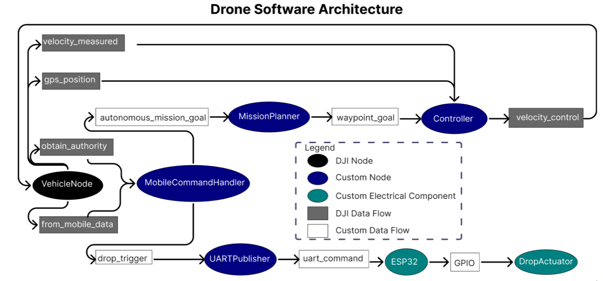
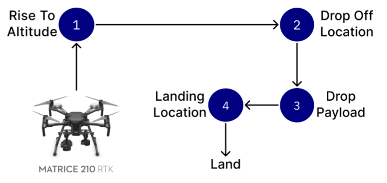

# Medrone Onboard SDK - Autonomous Drone Delivery System

This repository contains the onboard software developed for the Medrone project, an autonomous drone system for emergency AED delivery. Built on top of DJI's ROS Onboard SDK (OSDK), this project extends the framework with custom software for autonomous flight, payload handling, and mission execution.

> **Note:** DJI's OSDK provides the core drone functionality. This work extends the framework with custom C++ nodes for autonomous emergency response capabilities.

## 🎯 Project Overview

The Medrone system enables autonomous drone flight for emergency medical supply delivery, featuring:
- **Autonomous Navigation**: GPS-based waypoint navigation with <0.5m error at 200m range
- **Payload Delivery**: Precision AED drops within 0.8m of target from 3-5m altitude
- **Real-time Control**: Ground station communication with manual override capability
- **Robust Testing**: 100% success rate across 30+ payload drop tests

## 🏗️ System Architecture

*Figure 1: Drone Software Architecture showing custom ROS nodes (blue) integrated with DJI OSDK*

### Custom ROS Nodes

I implemented four custom C++ ROS nodes that extend DJI's OSDK functionality:

#### 1. **MobileCommandHandler Node**
- Receives and processes commands from ground station (dispatcher)
- Manages command pipeline: ID byte → handler mapping → data processing → execution
- Handles both absolute and relative GPS missions
- Implements concurrency control using atomic operations and mutexes for authority checks

#### 2. **UARTPublisher Node**
- Bridges onboard computer with ESP32-based actuator PCB
- Transmits UART messages for payload release control

#### 3. **MissionPlanner Node**
- Computes autonomous flight paths with 3-waypoint trajectory
- Generates dynamic missions based on start/end GPS coordinates

*Figure 2: MissionPlanner autonomous flight path with waypoints*

#### 4. **Controller Node**
- Implements 3D proportional (P) controller for waypoint navigation
- Handles position control in x, y, z dimensions
- Iteratively developed from basic altitude control to full 3D control

## 🔧 Payload Drop System

*Figure A3: Onboard Software Drop Trigger Sequence*

### Implementation
- **Communication Pipeline**: PS5 Controller → Ground Station → Onboard Software → UART → ESP32 → GPIO → Solenoid
- **Load Capacity**: Successfully tested with 1kg metal weight (exceeds AED payload weight)
- **Precision**: 15 near-bystander drops consistently within 0.8m of target
- **Reliability**: 30 consecutive drops with 100% success rate

## 🛠️ Technical Stack

- **Framework**: Robot Operating System (ROS)
- **Language**: C++
- **SDK**: DJI ROS Onboard SDK (OSDK)
- **Hardware**: DJI Matrice 210 RTK V2

## 📁 Repository Structure

Structured like the original DJI OSDK repo. The main entry point is the custom launch file in launch/run_mission_manifold.launch. 

## 📈 Performance Metrics

- **GPS Accuracy**: <0.5m error at 200m range
- **Drop Precision**: 0.8m radius from target
- **Success Rate**: 100% (30+ consecutive tests)
- **Response Time**: <100ms command processing
- **Autonomous Range**: Successfully tested up to 200m

## 🔮 Future Improvements

- **Enhanced Plant Model**: Incorporate more accurate drone dynamics to reduce overshoot
- **Advanced Control**: Implement PID or adaptive control for better disturbance rejection
- **Path Optimization**: A* or RRT* algorithms for obstacle avoidance

## 📝 License

This project extends DJI's OSDK and is for research and educational purposes.

## 🙏 Acknowledgments

- DJI for the ROS Onboard SDK framework
- Medrone team members for collaboration on system integration

---

> **Demo Video**: [Full emergency response simulation available](https://drive.google.com/drive/folders/1zl0YtmxhO2hS3o8iBxrYlbMw4D5y6X4z) - drone autonomously flies 200m, delivers AED, and returns to base

> This repository focuses on extending DJI's OSDK with experimental features for autonomous emergency response. It demonstrates the integration of control theory, embedded systems, and robotics for real-world applications.